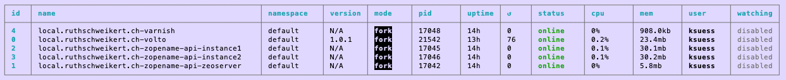

rohbergplonedeployment
======================

Plone 6 Volto deployment with Batou. 

**#Plone #Python #batou #ReactJS #Volto #pm2 #CMS**

## Stack

* Varnish
* Volto app
* HAProxy
* Plone (ZEO with two clients)

pm2 for process management


# How do I use this template to setup deployment with my Volto app?


Create your repository from this template. Customize it: your Volto app, current Plone version, etc..

Steps
- Create a repository from this template
- Clone your repository locally
- run ./batou
- customize your first environment local.cfg
- deploy to your first environment with ./batou deploy local 
- find your new environment in ./work/
- start with pm2 start ./work/pm2/website.pm2.config.js
- see processes with pm2 list 
- start haproxy with sudo haproxy -f path-to-your-project/work/haproxy/haproxy.cfg

- create new environment: environment/mars.cfg
- deploy to mars with ./batou deploy mars

- Install kitconcept.volto in http://localhost:8080/Plone/prefs_install_products_form

## Documentation of tools and components used

- Process management with pm2: https://pm2.keymetrics.io/docs/usage/pm2-doc-single-page/
- Deployment with Batou https://batou.readthedocs.io

## HAProxy

HAProxy is not managed by pm2 as we expect its configuration not to change often.

Run haproxy with 

```sudo haproxy -f /home/plone/schweikertstaging/work/haproxy/haproxy.cfg ```

cfg will drop privileges to user haproxy.

## Local deployment on nginx


```
upstream volto {
    server localhost:3000;
}
upstream ploneapi {
    server localhost:11080;
}

location ~ /api($|/.*) {
  rewrite ^/api($|/.*) /VirtualHostBase/http/voltodeployment.example.com:80/Plone/VirtualHostRoot/_vh_api$1 break;
  proxy_pass http://ploneapi;
}

location ~ / {
  # Default set to 1m - this is mainly to make PSI happy, adjust to your needs
  location ~* \.(ico|jpg|jpeg|png|gif|svg|js|jsx|css|less|swf|eot|ttf|otf|woff|woff2)$ {
  add_header Cache-Control "public";
  expires +1m;
  proxy_pass http://volto;
}
````

Open http://voltodeployment.example.com/ to access Volto app via Varnish.


## Troubleshooting


All processes running?

`pm2 list`




## Tips


- No Jinja in cfgs in /zope/profile

## Sugar

`pm2 show local.mywebsite.ch-volto`

shows even last git update date.


## TODO

- TODO Remove all Rohberg project traces from this template
- Continuous integration has not been set up. 
GitHub Actions and several other apps can be used to automatically catch bugs and enforce style. 

## Remarks
